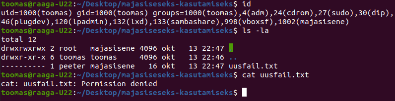
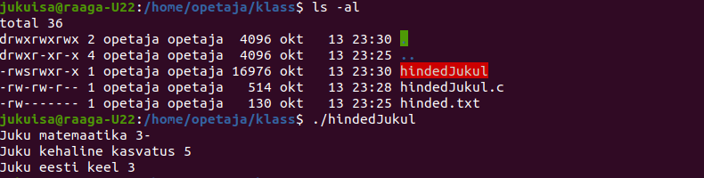

1. Missuguseid õigusi (r,w,x) on Unixis omanikul minimaalselt vaja (`d` - directory, `f` - fail)
   
   - a) kataloogile `/d` faili `/d/f` lugemiseks ning
     
     **r-x**
   
   - b) failile `/d/f` faili `/d/f` lugemiseks
     
     **r--**
   
   - c) kataloogile `/d` faili `/d/f` kustutamiseks
     
     **rwx**
   
   - d) failile `/d/f` faili `/d/f` kustutamiseks?
     
     **---**

2. Miks `chmod a=x skriptifail`ei ole piisav õigus shelli skriptifaili käivitamiseks? Millist õigust lisaks käivitamis-õigusele veel vaja läheb shelli skripti käivitamiseks? Põhjendage lühidalt?
   
   **Lisaks käivitamis-õigusele on failile vaja lisada ka lugemis-õigus**

3. Milleks on kasulik see, et igal kasutajal on omanimeline grupp? (teema: umask lõpp)
   
   **See aitab hallata kasutaja vahelisi õigusid**

4. Milliseid on minimaalsed õigused (rwx), mis on vajalikud teie tavakasutajal (kuulub gruppi majasisene) (mitte `root` või `peeter` kasutajal, kausta ja faili omanikud) `uusfail.txt` sisu kuvamiseks. Esita ekraanivaade `id`, `ls -la` ja `cat uusfail.txt` käskude väljundist tõestamaks lahendust.
   
   **Faili sisu ei suutnud ma kahjuks ekraanile kuvada miskipärast läbi majasisene grupi kuid failile o=r õiguse andes sain.**
   
   

5. Tehke screenshot tulemusest, kus oleks näha `hinded.txt` failiõigused `ls -la hinded.txt` ja jukuisa käivituskäsk koos väljundiga ning lisage see oma viki lehele. (teema: `setuid` ja `setgid`.)
   
   **Setuid lubab kasutajal jooksutada skripti omaniku õigustega selle asemel, et jooksutada seda kasutaja õigustega**
   
   

6. Kas `setuid` või `setgid` kasutamine võib vähendada süsteemi turvalisust? Kui `JAH`, siis kuidas? kui `EI`, siis miks ei vähenda?
   
   **Võib vähendada süsteemi turvalisust kuna faili omanik võib olla root kasutaja ning siis pole piire õiguste mõttes**

7. Kirjutage oma viki lehele kõik kasutajaid, kes saavad `sticky bit` õigustega `yhiskaust` kataloogist nüüd `peeter` kasutaja loodud faile kustutada. (teema: sticky bit)

8. Uurige käsuga `ls -la` faili `hinded.txt` õigusi - mida märkate? Seejärel uurige õigusi täpsemalt, kasutades käsku `getfacl` ning kopeerige see tulemus oma vikilehele. (teema: ACL)

9. Kes saab `chattr +i` parameetriga faili sisu modifitseerida (kirjutada)? Milliste käskudega saate kustutada `testfail-2` nimelise `+i` parameetriga faili.
